# Architecture V2 — drawn architecture

Status: proposed; Grad 1 unless explicitly marked Future. These diagrams use Mermaid and follow C4 context/container semantics without requiring the experimental C4 parser. The [architecture](architecture-v2.md), [catalog](service-catalog-v2.md) and [communication contracts](communication-v2.md) define the precise boundaries. See [rendered diagrams](diagrams-v2-rendered.md) for portable SVG images.

Legend: solid arrows are synchronous requests or local writes; dashed arrows in structural diagrams are durable asynchronous facts/jobs or read-only projections. Databases belong to exactly one service. A worker inside an ownership boundary is a separate restricted runtime, not permission to share all credentials. Sequence-diagram dashed arrows are replies; durable delivery is explicitly labeled.

## 1. C4 level 1 — system context


The system does not collect shopper money into the platform account by default. Provider account approval and DNS control remain external dependencies.

## 2. C4 level 2 — containers and ownership


Workers shown beside an owner use that owner's narrowly scoped operation/evidence contracts, not broad API credentials. All five databases initially share one PostgreSQL instance. Callback intake is detailed in the deployment and provider flow diagrams.

## 3. Service communication — no event broker in Grad 1


The opposite-direction arrows are authority checks and independent lifecycle facts, not a synchronous circular checkout chain. Local payment/shipping jobs do not traverse another business service. No event-bus box is hidden in the delivery mechanism.

## 4. Storage ownership and intentional copies


Dashed copies are not writable masters. No owner writes another owner's database. Provider receipts and financial entries share an owner but remain distinct records with explicit recognition links.

## 5. Conceptual ERD — important local invariants


This is a conceptual invariant map, not final DDL. All relationships stay within the named owner's database; every tenant-owned relation includes tenant_id. Guest orders have no customer-account relationship. Local order obligations/COD entries need no provider receipt; entries record an explicit source type/reference. A provider callback may recognize zero effects, and multiple receipts for one capture must not create multiple monetary entries.

## 6. Merchant registration and store preparation

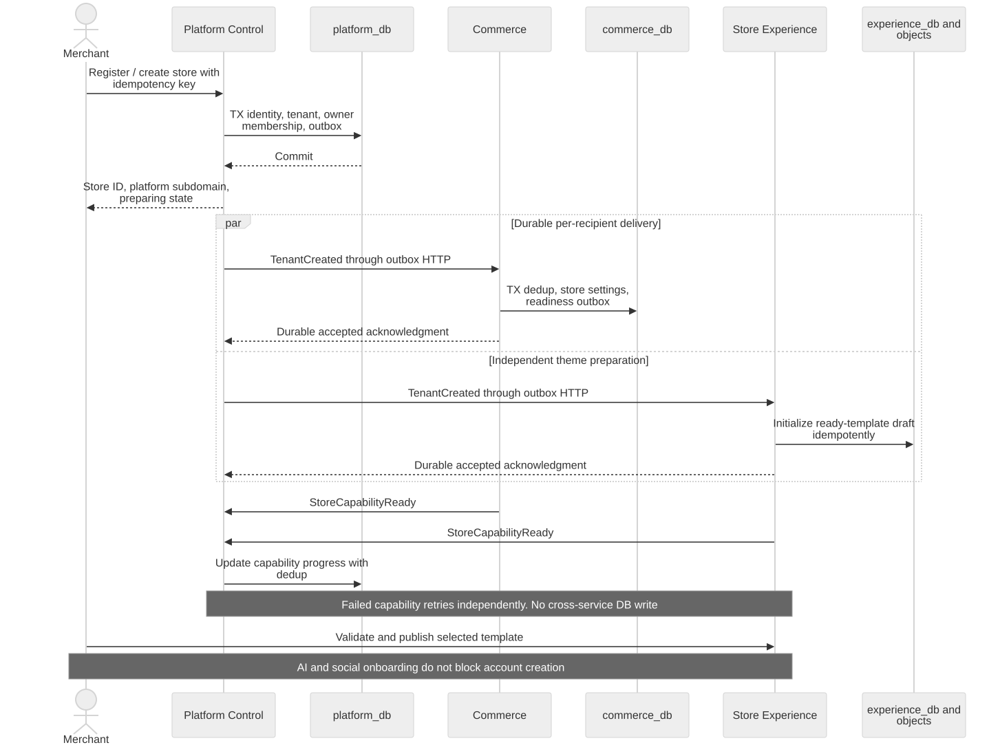

## 7. Customer browsing, store-local accounts and checkout

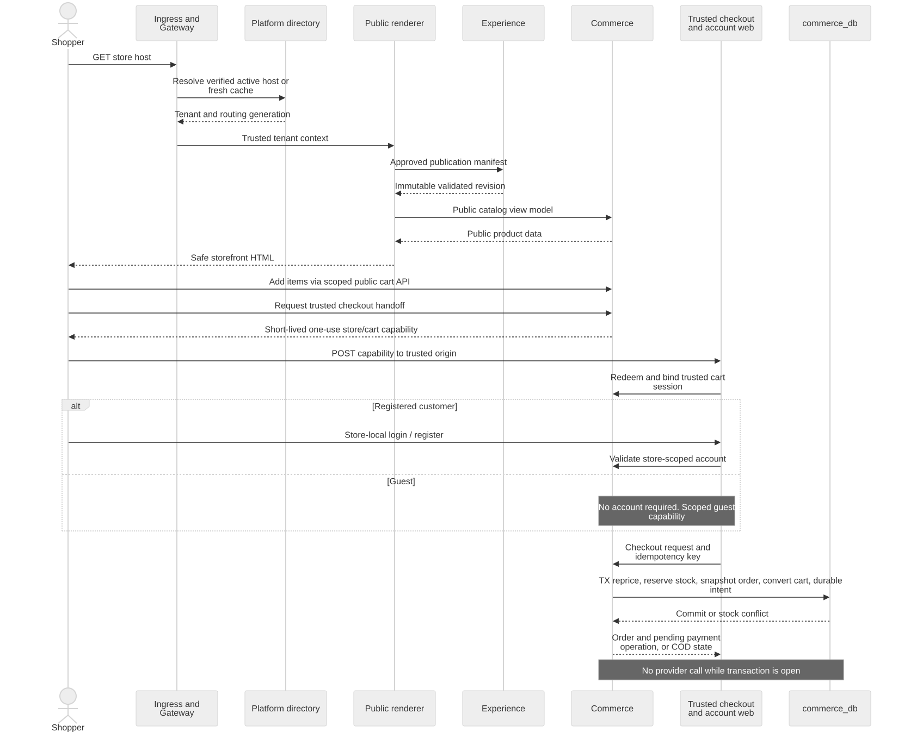

## 8. Customer payment — Paymob or Fawry

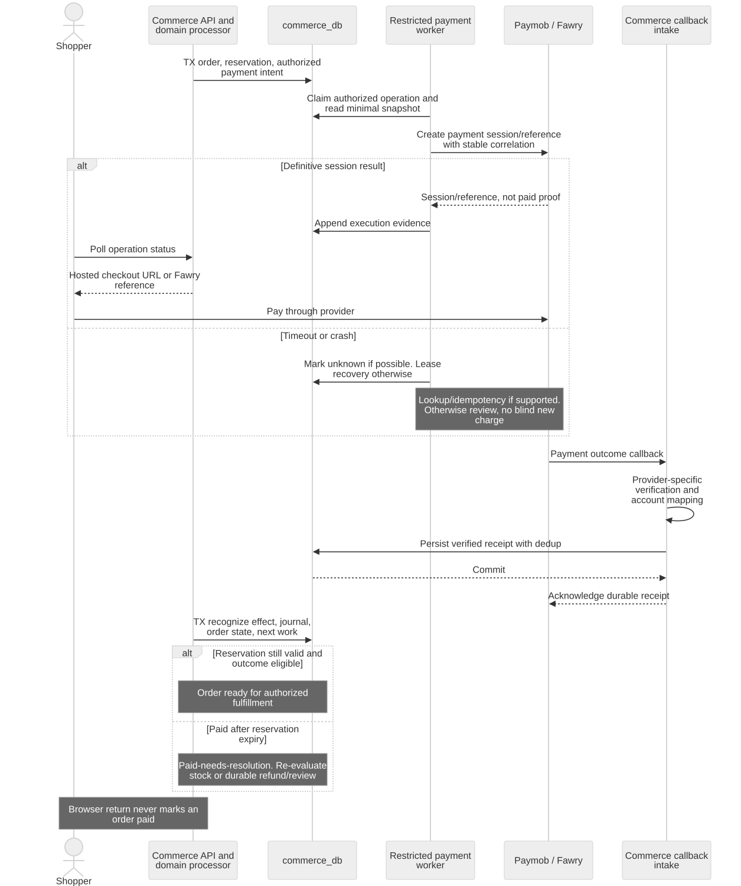

## 9. Subscription payment — Kashier, a separate money flow

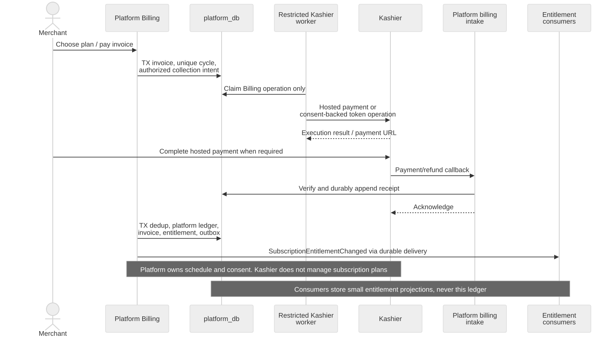

## 10. Shipping — Bosta first, J&T after contract verification

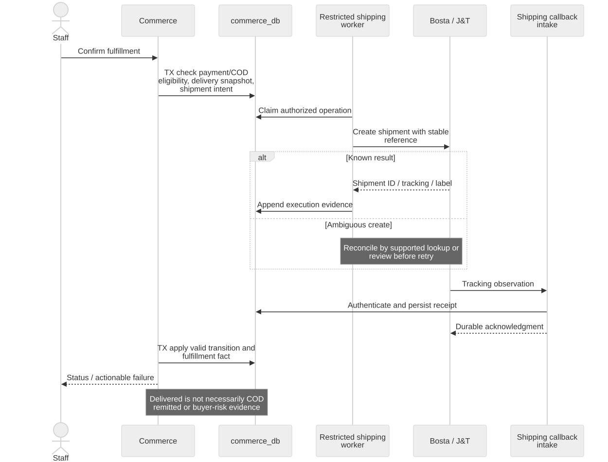

## 11. Unified private-message inbox

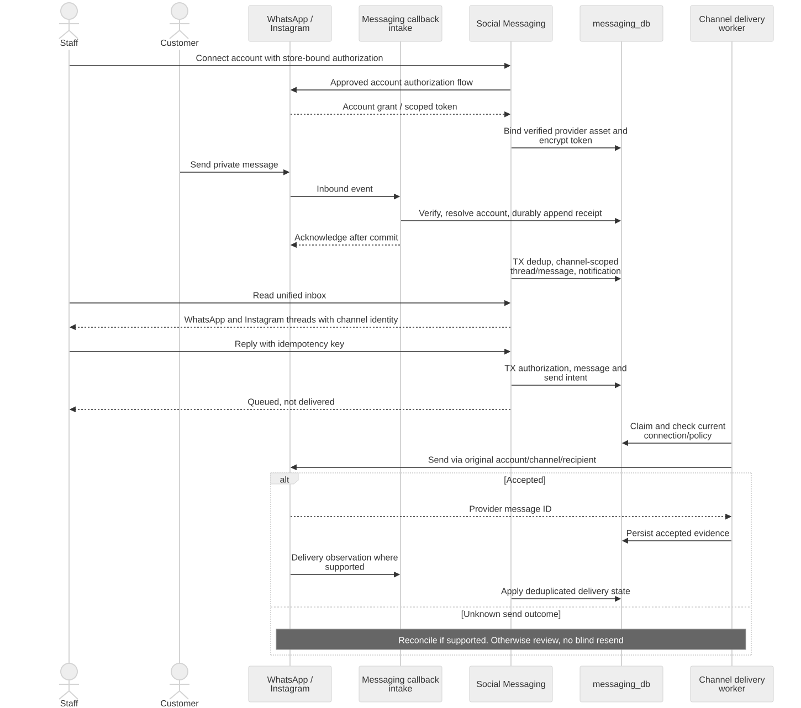

## 12. Custom domain — automated but conditional

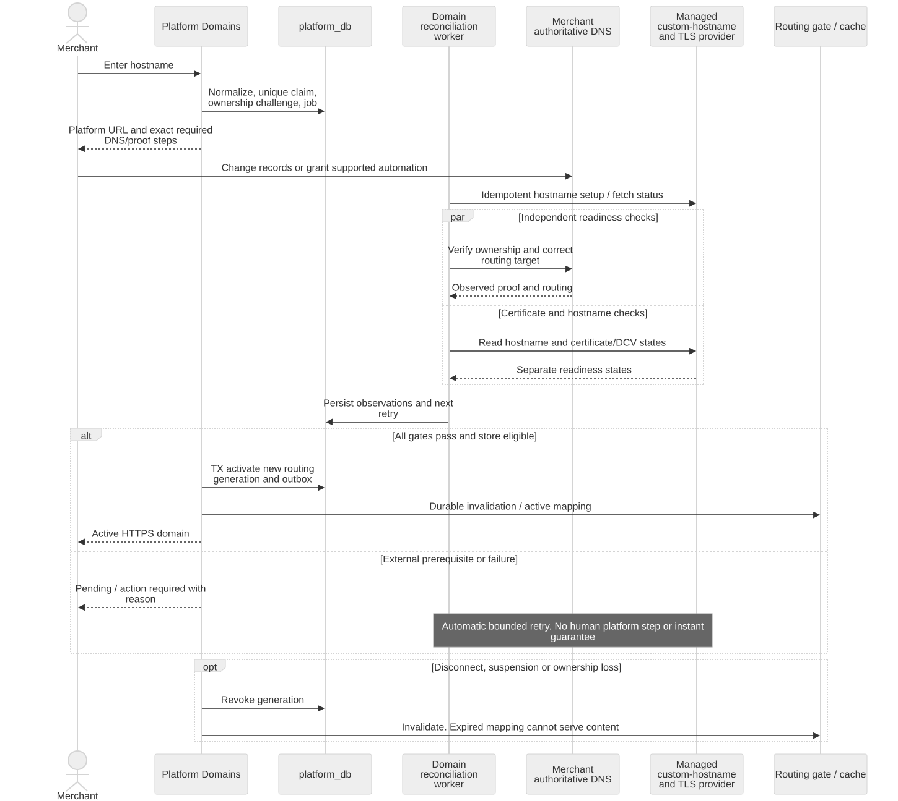

## 13. Theme editing — direct code and actual AI patches

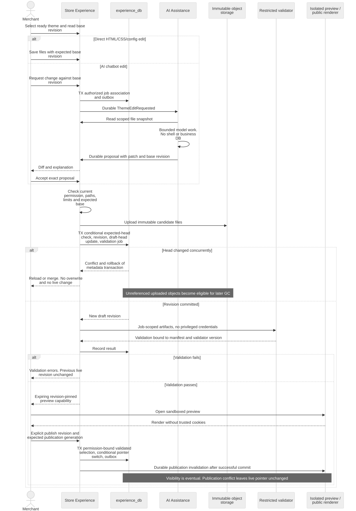

## 14. Employee authorization and revocation

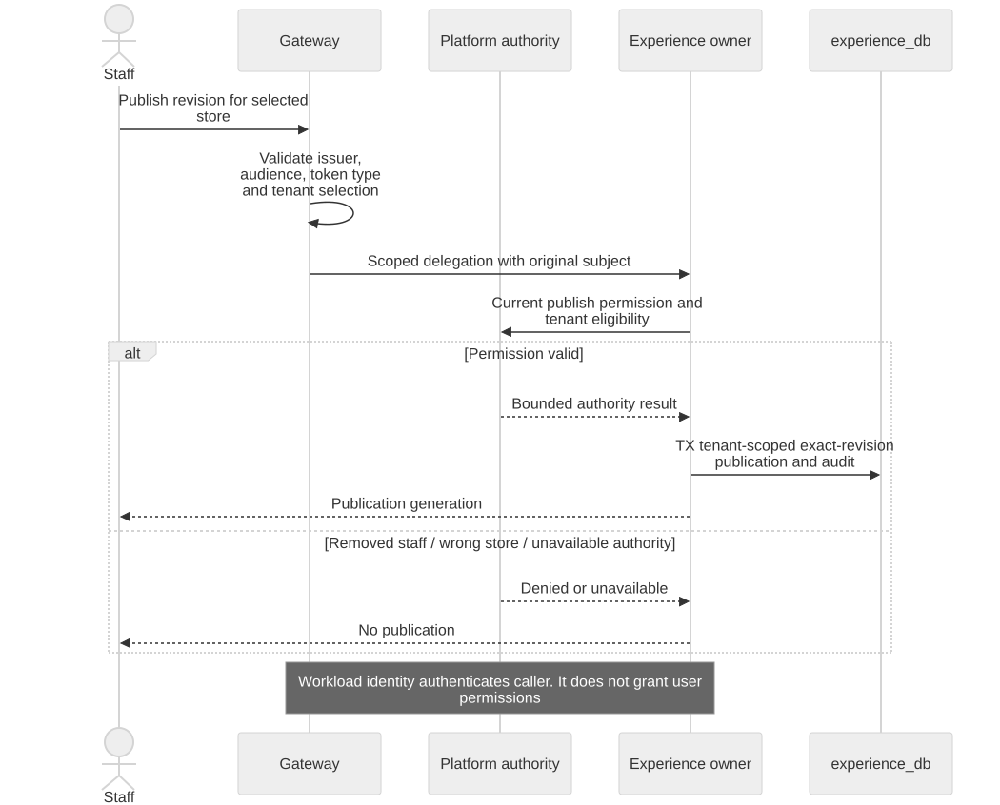

## 15. Deployment/infrastructure — honest Grad 1 runtime view


Separate process roles, network permissions, secret injection and resource limits are mandatory. There are more runtimes than five APIs. A shared host, database instance and ingress remain common failure domains. Startup evolution adds managed recovery/replicas as justified; Kubernetes is not part of this diagram.

## 16. Future only — cross-store Trust without shared customer accounts

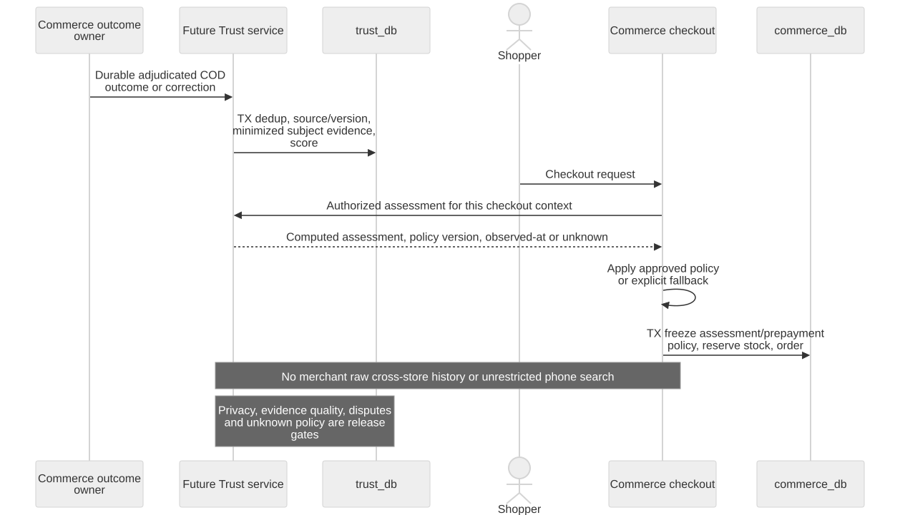

Future AI ordering must follow authorized Commerce commands and confirmation, not transform a social message into direct stock/payment database writes. It is not enabled by the Grad 1 theme-assistance permission set.
